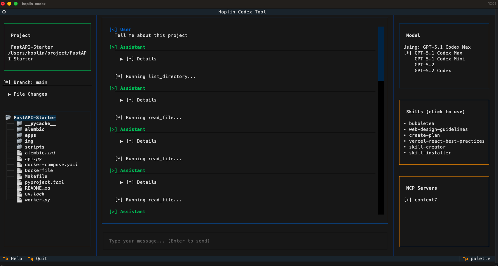
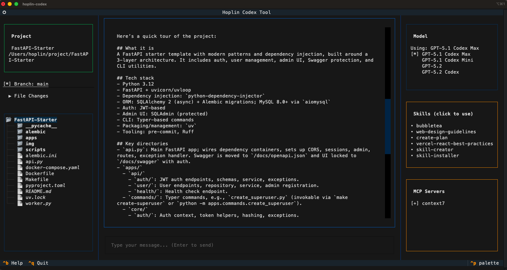

# Hoplin Lab Terminal UI Applications

## Hoplin Terminal IDE
This tap distributes the hoplin-codex binary via Homebrew.

### Build with

- Python 3
- Textualize

### Install (public repo)

```sh
# Add tap to homebrew
brew tap J-Hoplin/homebrew https://github.com/J-Hoplin/homebrew.git

# Install
brew install J-Hoplin/homebrew/hoplin-codex-tool
```

### About Hoplin Terminal IDE
- Keyboard-first terminal IDE built with Textual.
- Agent tools (read/write/patch files, shell, grep) with user consent.
- MCP client support (stdio/http) via `~/.codex/config.toml`.
- Sessions: save/restore chats; manage multiple conversations.
- Git-aware UI: branch switcher, live status, diff viewer.
- Skills and `@filename` context for project-aware assistance.
- Keyboard shortcuts:

| Scope      | Key        | Action                     |
|------------|------------|----------------------------|
| Global     | `p`        | Select project             |
| Global     | `s`        | Sessions                   |
| Global     | `b`        | Switch branch              |
| Global     | `m`        | Select model               |
| Global     | `a`        | Authenticate               |
| Global     | `h`        | Toggle hidden files        |
| Global     | `q`        | Quit                       |
| Ctrl       | `Ctrl+R`   | Refresh all                |
| Ctrl       | `Ctrl+T`   | Toggle shell               |
| Ctrl       | `Ctrl+F`   | Toggle file changes panel  |
| Ctrl       | `Ctrl+D`   | Toggle dark mode           |
| Ctrl       | `Ctrl+L`   | About                      |
| Ctrl       | `Ctrl+B`   | Help                       |
| Ctrl       | `Ctrl+C`   | Cancel response            |
| File Tree (focused) | `n` | New file                  |
| File Tree (focused) | `r` | Rename                    |
| File Tree (focused) | `d` | Delete                    |
| File Tree (focused) | `e` | View/Edit                 |


### How it look


